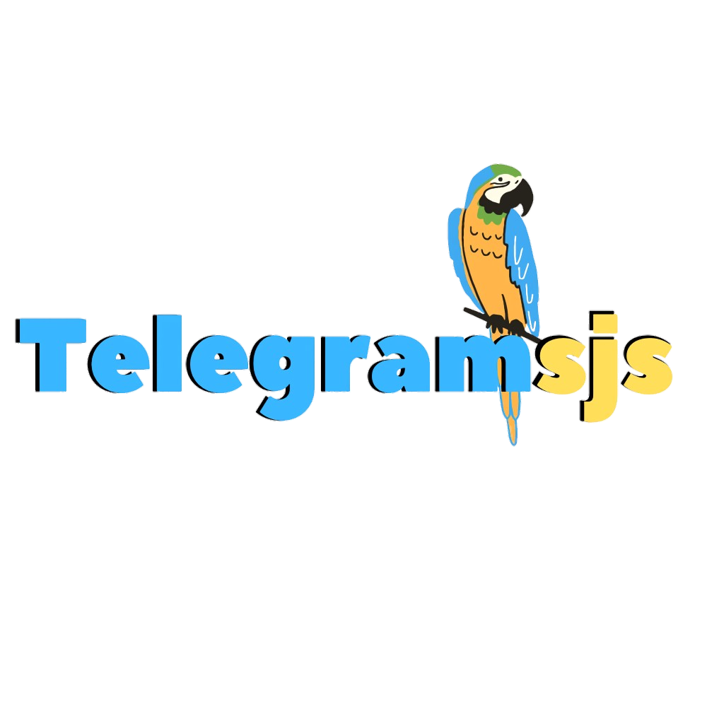

# TelegramsJS Library



`TelegramsJS` is a powerful and versatile library for building Telegram bots in `TypeScript`/`JavaScript`. It provides a range of features to simplify bot development, including message handling, file management, and interaction with the Telegram API.

## Features

- **Message Handling**: Easily handle incoming messages and events from Telegram users.
- **File Management**: Manage files, send images, videos, and documents effortlessly.
- **Interaction**: Interact with users through reactions, messages, and more.
- **ESM Support**: Full support for ECMAScript Modules for better code organization and smaller package sizes.

## Installation

To install `TelegramsJS` and its related libraries, you can use npm or yarn:

```bash
npm install telegramsjs @telegram.ts/collection @telegram.ts/types @telegram.ts/emoji @telegram.ts/formatters
```

or

```bash
yarn add telegramsjs @telegram.ts/collection @telegram.ts/types @telegram.ts/emoji @telegram.ts/formatters
```

For more detailed usage and examples, refer to the [documentation](#).

## Related Libraries

- **[@telegram.ts/collection](https://github.com/telegramsjs/collection)**: Collection utilities for `TelegramsJS`.
- **[@telegram.ts/types](https://github.com/telegramsjs/types)**: `TypeScript` types for Telegram API objects.
- **[@telegram.ts/emoji](https://github.com/telegramsjs/emoji)**: Emoji utilities for `TelegramsJS`.
- **[@telegram.ts/formatters](https://github.com/telegramsjs/formatters)**: Formatters for text and messages in `TelegramsJS`.

## Contribution

Contributions are welcome! If you'd like to contribute to `TelegramsJS`, please check out our [contribution guidelines](CONTRIBUTING.md).

## License

`TelegramsJS` is licensed under the MIT License. See [LICENSE](LICENSE) for more information.